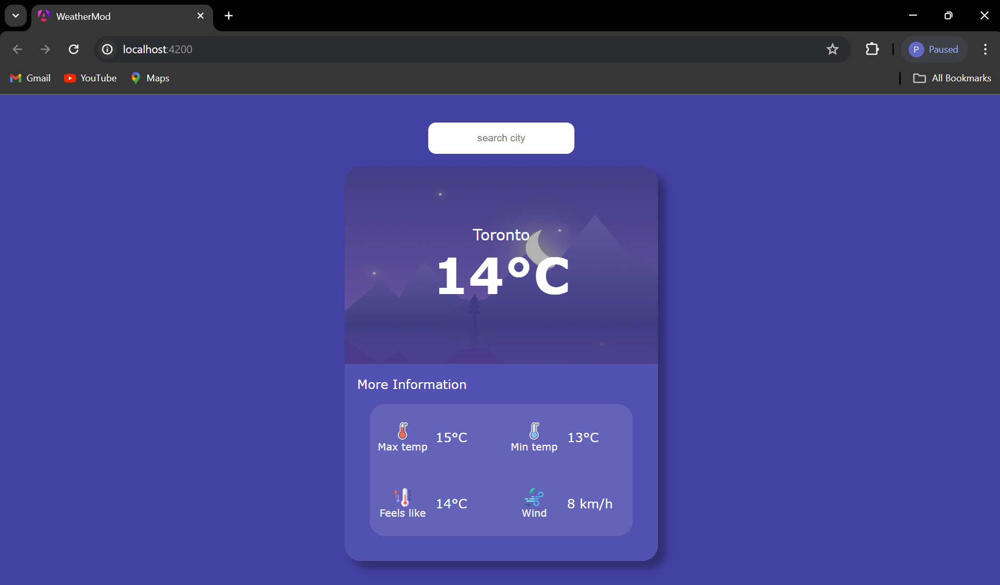
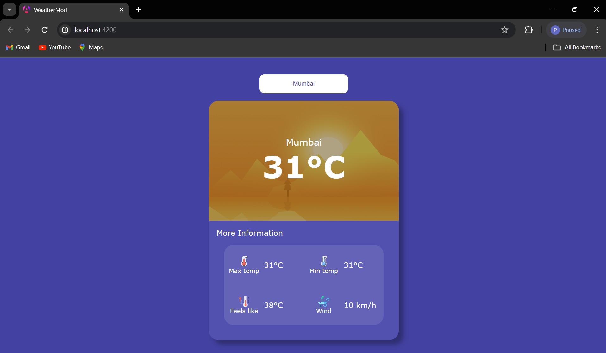

# Weather-App

## Table of Contents

- [Introduction](#introduction)
- [Features](#features)
- [Technology Stack](#technology-stack)
- [Installation](#installation)
- [Usage](#usage)
- [Screenshots](#screenshots)
- [Contributing](#contributing)

## Technologies used


## Introduction

Welcome to the Weather-App! This is an Angular web application that fetches weather data from an external API and displays it to the user. The application is designed to be user-friendly and provides real-time weather updates for any specified city.

## Features

- Fetches real-time weather data from the Open Weather API.
- Displays current weather conditions including temperature, humidity, and wind speed.
- Simple and intuitive user interface.
- Error handling for network issues and invalid city names.

## Technology Stack

- **Angular**: Frontend framework for building the user interface.
- **TypeScript**: Language for writing Angular application code.
- **HTML/CSS**: Structure and styling of the application.
- **RapidAPI**: Service used to fetch weather data.

## Usage

1. Try the app out without downloading it by clicking [here.](https://weather-app-2fb9a.firebaseapp.com)
2. Enter the name of the city for which you want to fetch the weather.
3. View the current weather details displayed on the screen.

## Installation

To run this application locally, follow these steps:

1. **Clone the repository**:

    ```bash
    git clone https://github.com/pharpala/Weather-App.git
    cd Weather-App
    ```

2. **Install dependencies**:

    ```bash
    npm install
    ```

3. **Run the application**:

    ```bash
    ng serve -o
    ```

4. **Open your browser** and navigate to `http://localhost:4200`.

## Screenshots

Here are some screenshots of the application:

### Home Screen



### Weather Display



## Contributing

Contributions are welcome! Please open an issue or submit a pull request for any improvements or bug fixes. For major changes, please open an issue first to discuss what you would like to change.
